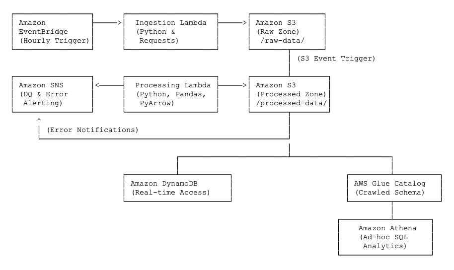

# Serverless ETL Data Pipeline on AWS

This repository contains the source code for a production-ready, event-driven ETL pipeline built entirely on AWS serverless technologies. The project automatically ingests data from a third-party API, validates data quality, transforms the payload, and persists the data in a dual-storage solution optimized for both analytical querying and real-time application access.

---
## Architecture Overview

The architecture is designed for scalability, resilience, and operational efficiency by leveraging a decoupled, event-driven design.

---
## Key Features & Technical Highlights

* Infrastructure as Code (IaC): The entire infrastructure is defined and version-controlled using the AWS Serverless Application Model (SAM), ensuring consistent and repeatable deployments. All IAM roles and permissions are explicitly defined for security (Principle of Least Privilege). Permissions to S3, DynamoDB, SNS, and CloudWatch are scoped at the resource level, and cross-service access (e.g., S3-to-Lambda) is locked down using `SourceArn` and `SourceAccount` conditions to prevent unauthorized invocation.
* Event-Driven & Decoupled: The pipeline is fully event-driven. An EventBridge schedule triggers ingestion, and S3 Events trigger processing. This loose coupling makes the system resilient and easy to extend.
* Automated Data Quality: The processing function includes a data validation step. Invalid records are rejected and an alert is published to an SNS topic, preventing data corruption downstream and ensuring operational visibility.
* Optimized Data Storage:
    * Data Lake: Cleaned data is stored in S3 in the efficient, columnar Apache Parquet format, which significantly reduces query costs and improves performance in Amazon Athena.
    * NoSQL Database: A transformed subset of the data is loaded into DynamoDB, providing low-latency, key-value access for potential front-end applications.
* Serverless & Scalable: By using AWS Lambda, the pipeline automatically scales with the volume of data without requiring any server management.

---
## Challenges Encountered & Solutions Applied

This project involved solving several complex, real-world cloud engineering challenges:

1.  CloudFormation Circular Dependency: Encountered and resolved a persistent `Circular dependency` error between the S3 bucket and the Lambda function trigger. The final, robust solution involved manually defining the IAM Roles and Lambda Permissions to break the implicit dependency chain created by the SAM framework.
2.  Data Schema Inconsistency: Solved a `HIVE_BAD_DATA` error in Athena caused by data type inconsistencies from the source API. The solution was to enforce a consistent data type (`float`) on numeric fields using the Pandas library during the transformation step, ensuring the reliability of the analytical data layer.
3.  SAM CLI Deployment Failures: Debugged and overcame a stubborn `S3 Bucket does not exist` error by systematically isolating the cause to a faulty tool cache and implementing a definitive fix by manually creating the staging bucket (`aws s3 mb`) and using the `--s3-bucket` flag to override the default behavior.

---
## Local Development & Deployment

This project is built and deployed using the AWS SAM CLI.

1.  Prerequisites: AWS CLI, SAM CLI, Docker, Python 3.9+.
2.  Build: The `sam build` command compiles dependencies inside a Docker container that mirrors the Lambda runtime, ensuring compatibility.
3.  Local Testing: The `sam local invoke` command was used to test function logic locally, speeding up the development cycle.
4.  Deployment: The application is deployed using `sam deploy`. All configuration is managed via the `template.yaml` and `samconfig.toml` files.

---
## Future Enhancements

* CI/CD Automation: Implement a CI/CD pipeline using GitHub Actions to automatically build, test, and deploy the application on every push to the `main` branch.
* BI Dashboard: Connect Amazon QuickSight to Athena to create interactive dashboards for business intelligence.
